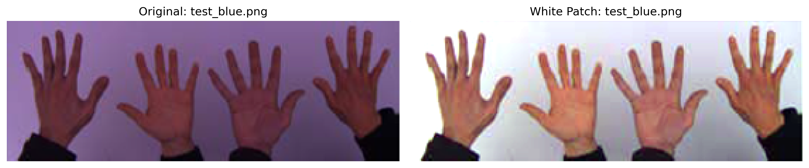
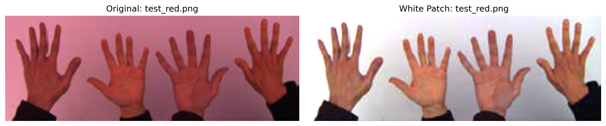
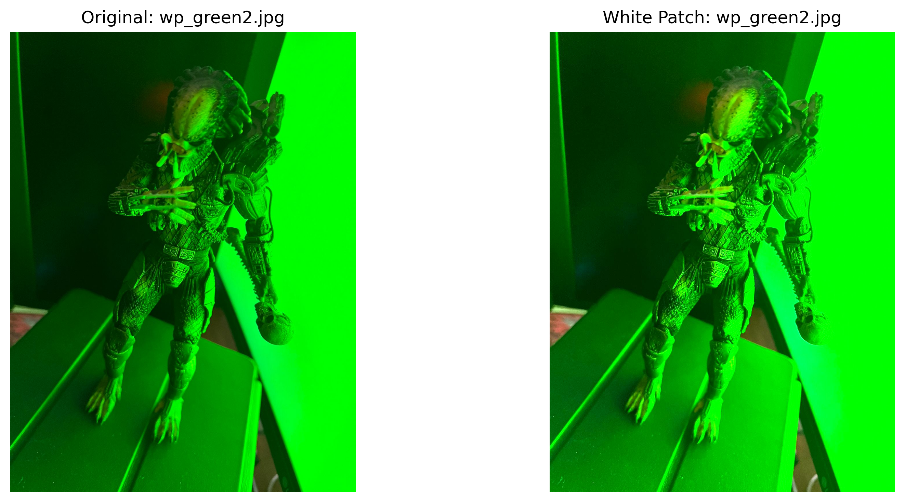
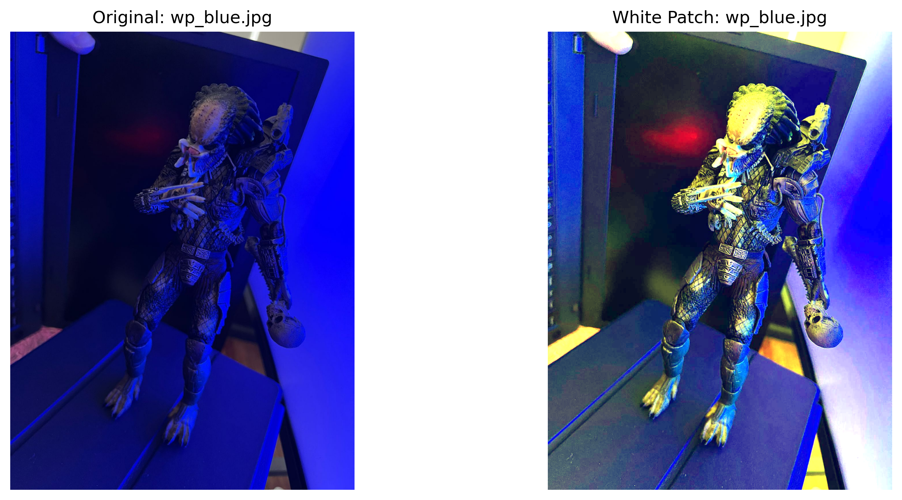

## Ejecución

Es necesario tener instalado Python 3.8 o superior y las librerías listadas en `requirements.txt`

```bash
python3 -m venv venv
source venv/bin/activate
pip install -r requirements.txt
```

Luego, para ejecutar cada punto, simplemente correr el archivo correspondiente:

```bash
python tp1_1.py
python tp1_2.py
```

## Respuestas:

En cuanto a si conviene usar histogramas como atributos para clasificar imágenes, sí es posible, pero hay que considerar que un histograma descarta la información espacial. Esto implica que dos imágenes pueden compartir exactamente el mismo histograma y, aun así, tener contenidos totalmente distintos, como muestra la Figura 1.


Figura 1: Dos imágenes completamente diferentes con histogramas idénticos

Por ese motivo, no lo sugeriría para tareas de clasificación. Hay enfoques que preservan mejor la estructura espacial, como la convolución con filtros, capaces de capturar rasgos locales y patrones, algo fundamental para este tipo de problemas.

## Algoritmo White Patch - Implementaciones

### Primera Implementación: Algoritmo Simple

Se desarrolló una versión básica que ofreció buenos resultados en las imágenes test_*.jpg, como puede verse en la Figura 2.




Figura 2: Resultados del algoritmo White Patch simple en imágenes de prueba

### Segunda Implementación: Manejo de Casos Borde

La implementación inicial no contemplaba situaciones límite, por ejemplo, cuando hay píxeles con valores 0 o 255. Por eso se creó una segunda versión que sí trata estos casos. Estas dos primeras iteraciones mostraron buenos resultados en las imágenes wp_*.jpg, como se observa en la Figura 3.


Figura 3: Resultados con manejo mejorado de casos borde

### Tercera Implementación: Algoritmo Inteligente

Por último, con ayuda de un agente en Copilot, se implementó una variante que primero clasifica la imagen a partir de la media y la desviación estándar del brillo y la saturación, para luego aplicar el método más adecuado según esa clasificación. A simple vista los resultados son buenos, aunque no afirmaría que superen a las versiones anteriores, como muestra la Figura 4.




Figura 4: Resultados del algoritmo White Patch inteligente con clasificación automática
